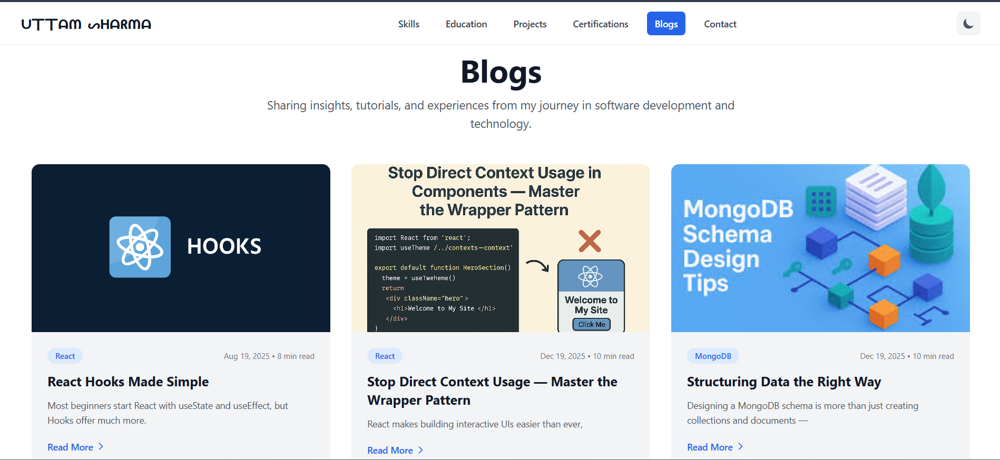
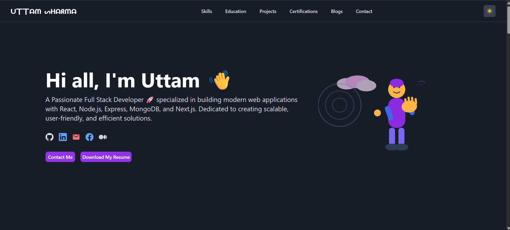

# React Portfolio

This is a personal portfolio website built with React, Vite, and Tailwind CSS. It showcases my skills, projects, and experience as a Full Stack Developer.

## Live Demo

[https://my-journyey.com](https://uttam-devjourney.netlify.app/)

## Features

*   **Responsive Design:** The portfolio is fully responsive and looks great on all devices.
*   **Dark Mode:** A toggle to switch between light and dark mode for better user experience.
*   **Smooth Scrolling:** Smooth scrolling to different sections of the portfolio.
*   **Interactive UI:** Engaging and interactive user interface with animations and transitions.
*   **Component-Based Architecture:** Built with a clean and modular component-based architecture.

## Technologies Used

*   **Frontend:**
    *   React.js
    *   Vite
    *   Tailwind CSS
    *   React Router
*   **Deployment:**
    *   Vercel

## Getting Started

To get a local copy up and running, follow these simple steps.

### Prerequisites

*   Node.js and npm installed on your machine.

### Installation

1.  Clone the repo
    ```sh
    git clone https://github.com/Uttamdevsharma/react-portfolio.git
    ```
2.  Install NPM packages
    ```sh
    npm install
    ```
3.  Start the development server
    ```sh
    npm run dev
    ```


## Screenshots

| Light Mode                                 | Dark Mode                                  |
| ------------------------------------------ | ------------------------------------------ |
|  |  |

## Contact

Uttam Sharma - [uttamrohit4545@gmail.com](mailto:uttamrohit4545@gmail.com)

Project Link: [https://github.com/Uttamdevsharma/react-portfolio](https://github.com/Uttamdevsharma/react-portfolio)
